# 블록체인 프로젝트 아키텍처 구성도

## 목차
1. [의존성 및 라이브러리 버전 맵](#1-의존성-및-라이브러리-버전-맵)
2. [상세 기술 스택](#2-상세-기술-스택)
3. [전체 시스템 아키텍처](#3-전체-시스템-아키텍처)
4. [외부 라이브러리 의존성 트리](#4-외부-라이브러리-의존성-트리)

---

## 1. 의존성 및 라이브러리 버전 맵

```mermaid
graph TB
    subgraph "프로젝트"
        Project["github.com/dooheeh/blockchain<br/>📦 Go 1.18+<br/>🏗️ 2017년 제작"]
    end

    subgraph "직접 의존성 (Direct Dependencies)"
        Base58["github.com/jbenet/go-base58<br/>📌 v0.0.0-20150317085156<br/>⚡ Base58 인코딩<br/>📄 Bitcoin-style addresses"]
        XCrypto["golang.org/x/crypto<br/>📌 v0.0.0-20220214200702<br/>⚡ RIPEMD-160 해싱<br/>📄 Extended crypto functions"]
    end

    subgraph "Go 표준 라이브러리 (Standard Library)"
        CryptoECDSA["crypto/ecdsa<br/>🔐 ECDSA P-256 서명<br/>📚 stdlib"]
        CryptoSHA["crypto/sha256<br/>🔐 SHA-256 해싱<br/>📚 stdlib"]
        CryptoRand["crypto/rand<br/>🔐 암호학적 난수<br/>📚 stdlib"]
        CryptoElliptic["crypto/elliptic<br/>🔐 타원곡선 P-256<br/>📚 stdlib"]
        EncodingBinary["encoding/binary<br/>📦 바이트 직렬화<br/>📚 stdlib"]
        Sync["sync<br/>🔒 Mutex 동시성 제어<br/>📚 stdlib"]
        Time["time<br/>⏰ 타임스탬프<br/>📚 stdlib"]
        Fmt["fmt<br/>📝 포맷 출력<br/>📚 stdlib"]
        Errors["errors<br/>❌ 에러 처리<br/>📚 stdlib"]
    end

    Project --> Base58
    Project --> XCrypto
    Project --> CryptoECDSA
    Project --> CryptoSHA
    Project --> CryptoRand
    Project --> CryptoElliptic
    Project --> EncodingBinary
    Project --> Sync
    Project --> Time
    Project --> Fmt
    Project --> Errors

    style Project fill:#e1bee7,stroke:#7b1fa2,stroke-width:3px
    style Base58 fill:#c8e6c9,stroke:#388e3c,stroke-width:2px
    style XCrypto fill:#c8e6c9,stroke:#388e3c,stroke-width:2px
    style CryptoECDSA fill:#bbdefb,stroke:#1976d2,stroke-width:1px
    style CryptoSHA fill:#bbdefb,stroke:#1976d2,stroke-width:1px
    style CryptoRand fill:#bbdefb,stroke:#1976d2,stroke-width:1px
    style CryptoElliptic fill:#bbdefb,stroke:#1976d2,stroke-width:1px
    style EncodingBinary fill:#fff9c4,stroke:#f57f17,stroke-width:1px
    style Sync fill:#ffccbc,stroke:#e64a19,stroke-width:1px
    style Time fill:#d1c4e9,stroke:#512da8,stroke-width:1px
    style Fmt fill:#b2dfdb,stroke:#00796b,stroke-width:1px
    style Errors fill:#ffcdd2,stroke:#c62828,stroke-width:1px
```

## 2. 상세 기술 스택

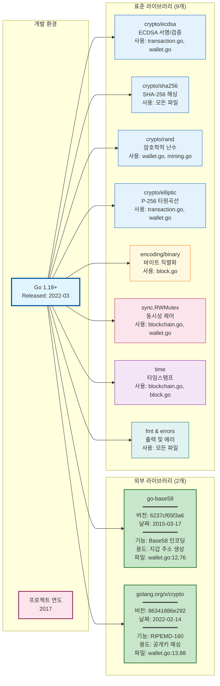

## 3. 전체 시스템 아키텍처

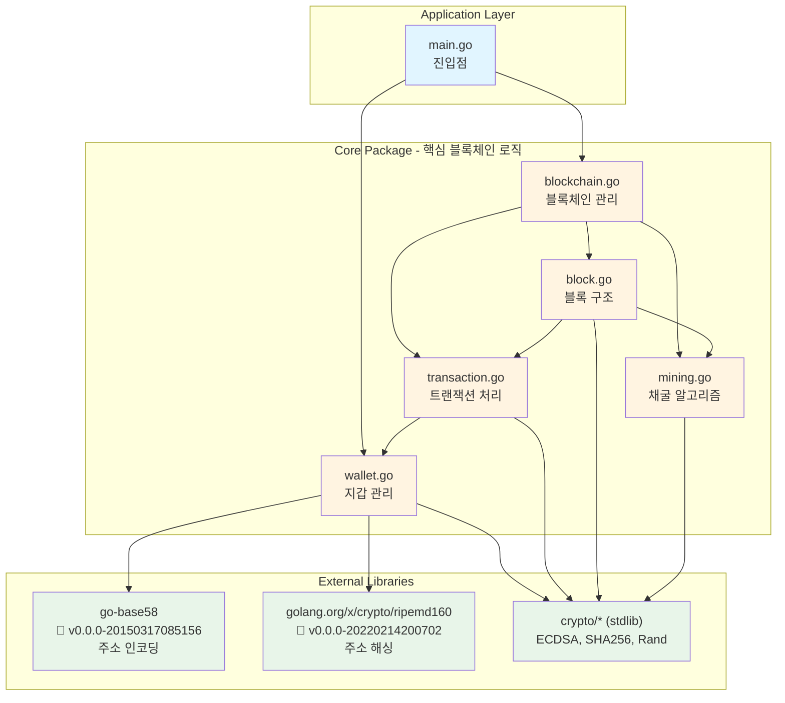

## 4. 외부 라이브러리 의존성 트리

```mermaid
graph TB
    subgraph "Application Code"
        WalletGo["wallet.go<br/>━━━━━━━━<br/>지갑 & 주소 생성"]
        TxGo["transaction.go<br/>━━━━━━━━<br/>트랜잭션 서명/검증"]
        BlockGo["block.go<br/>━━━━━━━━<br/>블록 해싱"]
        MiningGo["mining.go<br/>━━━━━━━━<br/>PoW 난수 생성"]
    end

    subgraph "External Dependencies"
        direction TB

        subgraph "go-base58 v0.0.0-20150317085156"
            Base58Encode["EncodeAlphabet()<br/>Bitcoin Base58 인코딩"]
            Base58Decode["DecodeAlphabet()<br/>Bitcoin Base58 디코딩"]
        end

        subgraph "golang.org/x/crypto v0.0.0-20220214200702"
            RIPEMD160["ripemd160.New()<br/>RIPEMD-160 해시 함수"]
        end

        subgraph "Go Standard Library (crypto/*)"
            ECDSA["crypto/ecdsa<br/>━━━━━━━━<br/>Sign()<br/>Verify()<br/>GenerateKey()"]
            SHA256["crypto/sha256<br/>━━━━━━━━<br/>Sum256()"]
            Rand["crypto/rand<br/>━━━━━━━━<br/>Reader<br/>Int()"]
            Elliptic["crypto/elliptic<br/>━━━━━━━━<br/>P256()"]
        end
    end

    WalletGo -->|"MakeAddress():77"| Base58Encode
    WalletGo -->|"Lock():258"| Base58Decode
    WalletGo -->|"PublickeyHash():88"| RIPEMD160
    WalletGo -->|"newKeypair():43"| ECDSA
    WalletGo -->|"newKeypair():42"| Elliptic
    WalletGo -->|"PublickeyHash():87"| SHA256

    TxGo -->|"Sign():109"| ECDSA
    TxGo -->|"Sign():109"| Rand
    TxGo -->|"Verify():169"| ECDSA
    TxGo -->|"Verify():143"| Elliptic
    TxGo -->|"CreateNewTransaction():101"| SHA256

    BlockGo -->|"CreateNewBlock():73"| SHA256
    BlockGo -->|"txhash():172"| SHA256

    MiningGo -->|"Mining():27"| Rand
    MiningGo -->|"Mining():33"| SHA256

    style WalletGo fill:#fff4e1,stroke:#f57c00,stroke-width:2px
    style TxGo fill:#fff4e1,stroke:#f57c00,stroke-width:2px
    style BlockGo fill:#fff4e1,stroke:#f57c00,stroke-width:2px
    style MiningGo fill:#fff4e1,stroke:#f57c00,stroke-width:2px

    style Base58Encode fill:#c8e6c9,stroke:#2e7d32,stroke-width:2px
    style Base58Decode fill:#c8e6c9,stroke:#2e7d32,stroke-width:2px
    style RIPEMD160 fill:#c8e6c9,stroke:#2e7d32,stroke-width:2px

    style ECDSA fill:#bbdefb,stroke:#1565c0,stroke-width:1px
    style SHA256 fill:#bbdefb,stroke:#1565c0,stroke-width:1px
    style Rand fill:#bbdefb,stroke:#1565c0,stroke-width:1px
    style Elliptic fill:#bbdefb,stroke:#1565c0,stroke-width:1px
```

## 5. 라이브러리 버전 및 사용 위치 상세

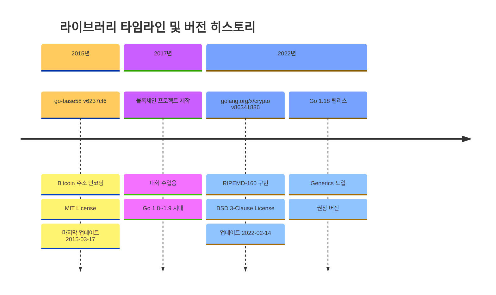

## 6. 파일별 라이브러리 사용 매트릭스

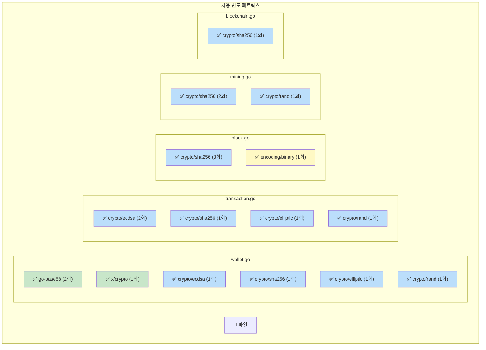

## 7. 데이터 구조 관계도

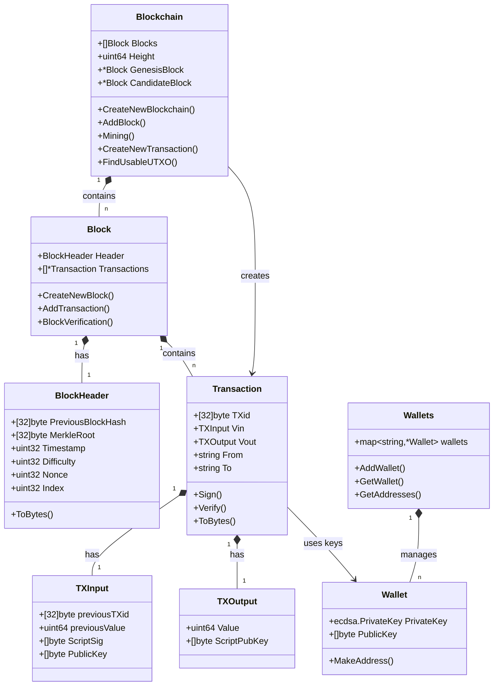

## 3. 트랜잭션 생성 플로우

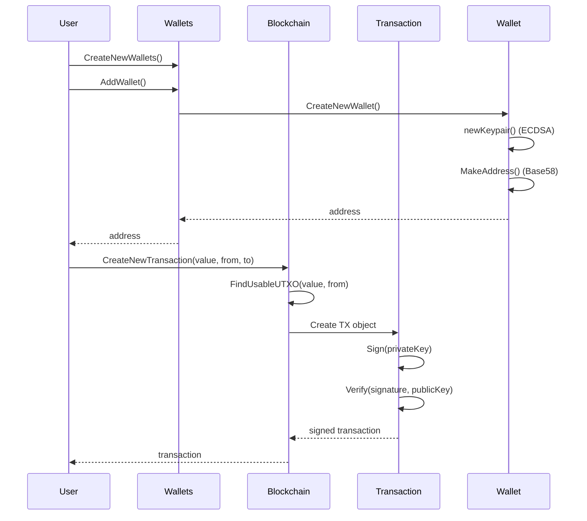

## 4. 블록 생성 및 채굴 플로우

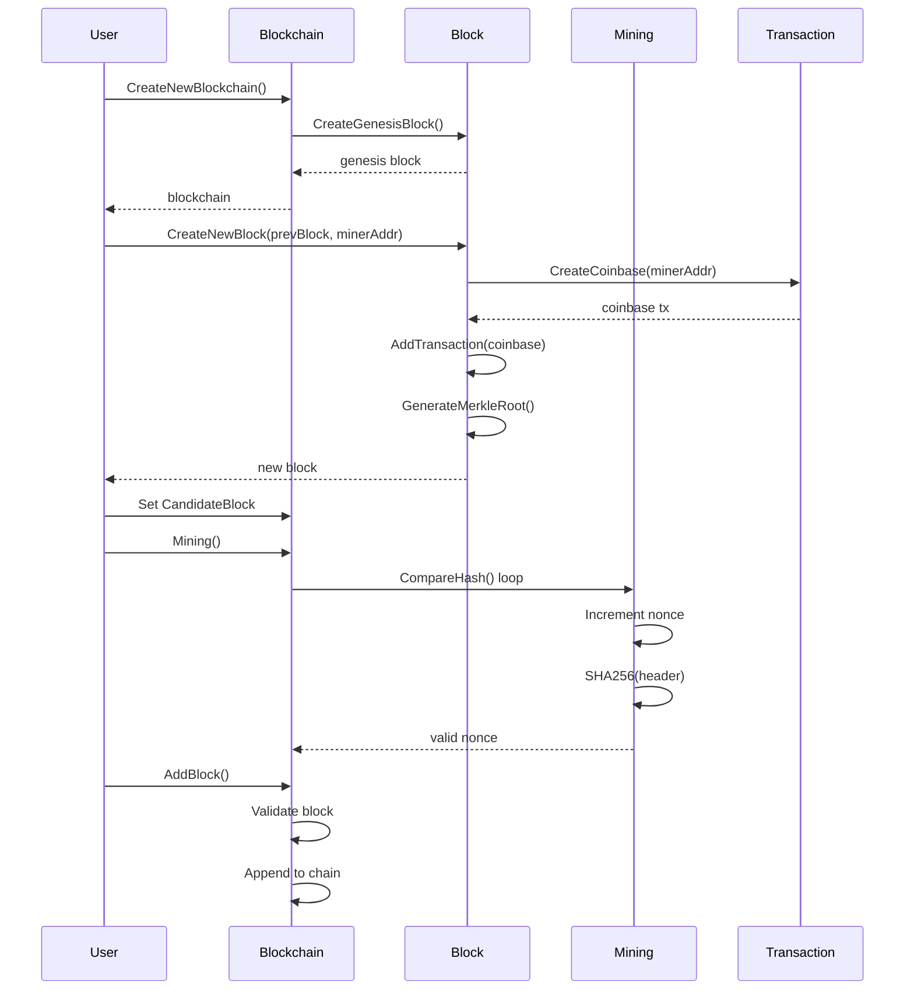

## 5. 모듈 간 의존성 맵

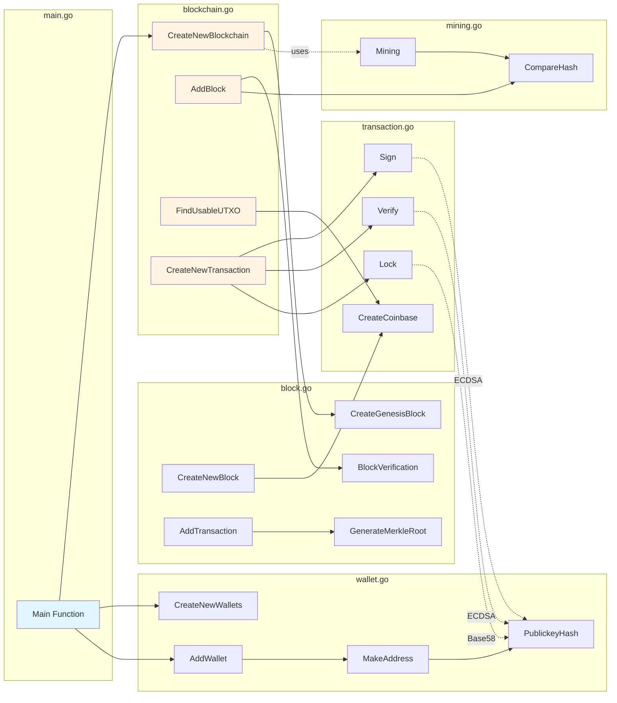

## 6. 암호화 기능 레이어

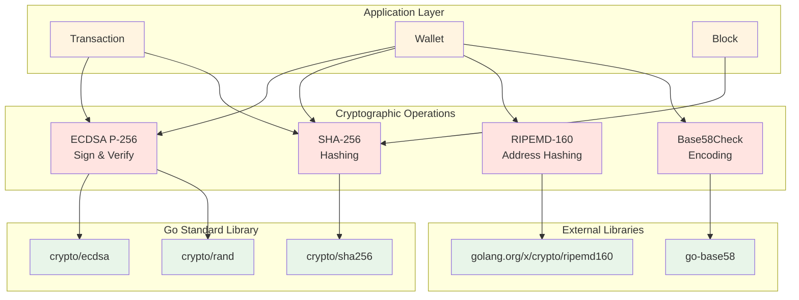

## 7. UTXO 모델 데이터 흐름

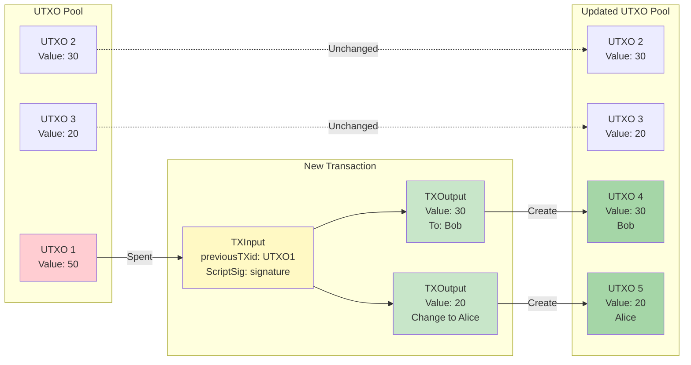

## 8. 파일별 주요 함수 및 책임

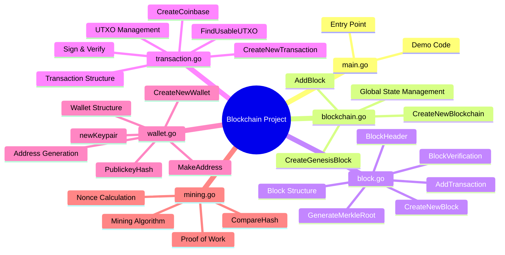

## 9. 비트코인 호환 레이어

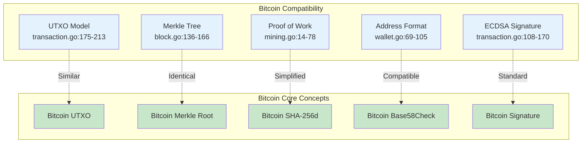

## 10. 동시성 제어 구조

```mermaid
graph TB
    subgraph "Global State"
        GlobalBC[var Blockchains []*Blockchain<br/>blockchain.go:12]
        GlobalMutex[var blockchainMutex sync.RWMutex<br/>blockchain.go:13]
    end

    subgraph "Blockchain Instance"
        BCBlocks[Blocks []Block]
        BCMutex[mu sync.RWMutex<br/>blockchain.go:21]
    end

    subgraph "Wallets Instance"
        WalletsMap[wallets map~string~*Wallet]
        WalletsMutex[mu sync.RWMutex<br/>wallet.go:21]
    end

    subgraph "Thread-Safe Operations"
        CreateBC[CreateNewBlockchain<br/>Lock: blockchainMutex]
        AddBlock[AddBlock<br/>Lock: bc.mu]
        AddWallet[AddWallet<br/>Lock: ws.mu]
        GetWallet[GetWallet<br/>RLock: ws.mu]
    end

    GlobalMutex -.Protects.-> GlobalBC
    BCMutex -.Protects.-> BCBlocks
    WalletsMutex -.Protects.-> WalletsMap

    CreateBC --> GlobalMutex
    AddBlock --> BCMutex
    AddWallet --> WalletsMutex
    GetWallet --> WalletsMutex

    style GlobalBC fill:#ffebee
    style GlobalMutex fill:#ffcdd2
    style BCBlocks fill:#fff9c4
    style BCMutex fill:#fff59d
    style WalletsMap fill:#e1f5fe
    style WalletsMutex fill:#81d4fa
```

---

## 다이어그램 렌더링 방법

이 다이어그램들은 Mermaid 문법으로 작성되었습니다. 다음 방법으로 시각화할 수 있습니다:

### 온라인 도구
1. **Mermaid Live Editor**: https://mermaid.live
   - 위 코드 블록을 복사하여 붙여넣기

2. **GitHub**:
   - 이 파일을 GitHub에 업로드하면 자동 렌더링

3. **VS Code**:
   - "Markdown Preview Mermaid Support" 확장 설치
   - 프리뷰 모드에서 확인

### CLI 도구
```bash
# Mermaid CLI 설치
npm install -g @mermaid-js/mermaid-cli

# PNG로 변환
mmdc -i ARCHITECTURE.md -o architecture.png
```

---

## 주요 인사이트

### 계층 구조
- **Application Layer**: main.go
- **Business Logic**: core 패키지 (5개 파일)
- **External Dependencies**: 2개 외부 라이브러리 + 9개 표준 라이브러리

### 의존성 방향
- 단방향 의존성 (순환 참조 없음)
- main → core → external libraries
- 외부 라이브러리는 경량 (총 2개만 사용)

### 핵심 상호작용
1. **blockchain.go** ↔ **block.go**: 블록 체인 관리
2. **block.go** ↔ **transaction.go**: 블록에 트랜잭션 포함
3. **transaction.go** ↔ **wallet.go**: 서명 및 검증
4. **blockchain.go** ↔ **mining.go**: PoW 수행

### 라이브러리 버전 정보

#### 외부 라이브러리
```
📦 github.com/jbenet/go-base58
   버전: v0.0.0-20150317085156-6237cf65f3a6
   릴리스: 2015년 3월 17일
   라이선스: MIT
   용도: Bitcoin 스타일 Base58Check 인코딩/디코딩
   사용 파일: wallet.go (2회 호출)

📦 golang.org/x/crypto
   버전: v0.0.0-20220214200702-86341886e292
   릴리스: 2022년 2월 14일
   라이선스: BSD 3-Clause
   용도: RIPEMD-160 해시 함수
   사용 파일: wallet.go (1회 호출)
```

#### Go 표준 라이브러리
```
🔐 crypto/ecdsa     - ECDSA P-256 디지털 서명
🔐 crypto/sha256    - SHA-256 해싱 (블록/트랜잭션 ID)
🔐 crypto/rand      - 암호학적 안전 난수 생성
🔐 crypto/elliptic  - P-256 타원곡선 연산
📦 encoding/binary  - 바이트 직렬화 (리틀 엔디안)
🔒 sync             - RWMutex 동시성 제어
⏰ time             - Unix 나노초 타임스탬프
📝 fmt              - 포맷 출력
❌ errors           - 에러 생성 및 처리
```

### 라이브러리 사용 통계

| 라이브러리 | 사용 파일 수 | 총 호출 횟수 | 주요 기능 |
|-----------|------------|------------|----------|
| crypto/sha256 | 5개 | 10회 | 블록 해싱, TX ID |
| crypto/ecdsa | 2개 | 4회 | 서명 생성/검증 |
| crypto/rand | 2개 | 3회 | Nonce, 키 생성 |
| go-base58 | 1개 | 2회 | 주소 인코딩 |
| crypto/elliptic | 2개 | 2회 | 키페어 생성 |
| x/crypto/ripemd160 | 1개 | 1회 | 주소 해싱 |
| encoding/binary | 1개 | 1회 | 블록 헤더 직렬화 |

### 프로젝트 메타데이터

```yaml
프로젝트명: github.com/dooheeh/blockchain
Go 버전: 1.18+ (권장)
제작 시기: 2017년
목적: 대학 블록체인 수업 교재
외부 의존성: 2개
표준 라이브러리: 9개
총 코드 파일: 6개 (main.go + core/*.go 5개)
라이선스: 명시되지 않음
```
